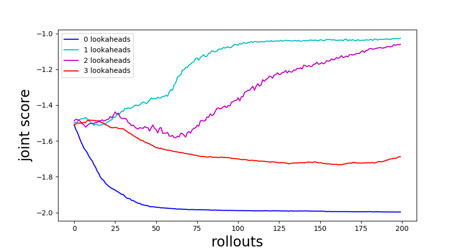
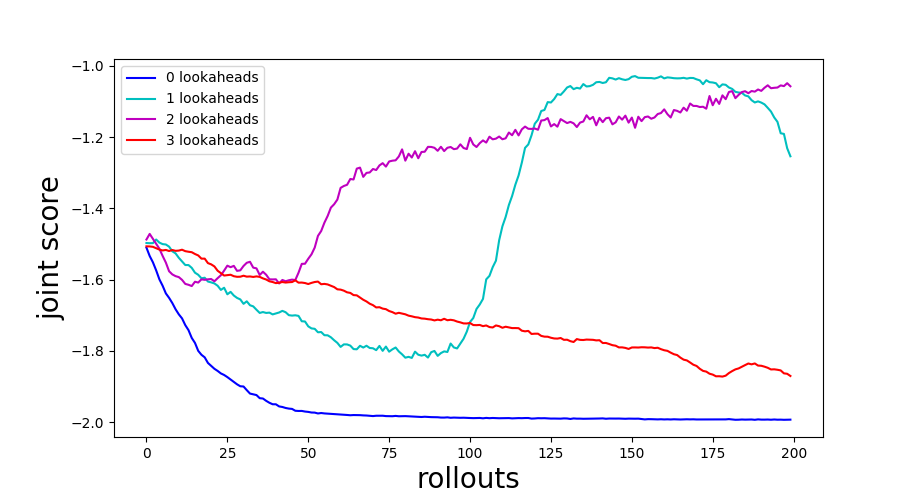
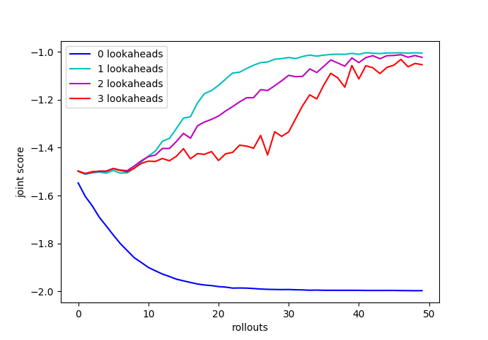
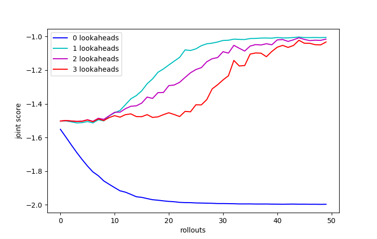

# LOLA_DiCE
Pytorch implementation of LOLA (https://arxiv.org/abs/1709.04326) using DiCE (https://arxiv.org/abs/1802.05098)

## Quick results:

### Results on IPD using DiCE 
[lr_in=0.3, lr_out=0.2, lr_v=0.1, batch_size=128, len_rollout=150, use_baseline=True]

### Results on IPD using DiCE and opponent modelling
[lr_in=0.3, lr_out=0.2, lr_v=0.1, batch_size=128, len_rollout=150, use_baseline=True]

(It seems that 2 lookaheads is the most stable model with this set of hyperparameters)

### Results on IPD using exact gradients 
[lr_in=0.3, lr_out=0.2, batch_size=128, len_rollout=150]

### Results on IPD using exact gradients and opponent modelling
[lr_in=0.3, lr_out=0.2, batch_size=128, len_rollout=150]

## Authors version:

The authors of the paper have their own version (Tensorflow) available here: https://github.com/alshedivat/lola
